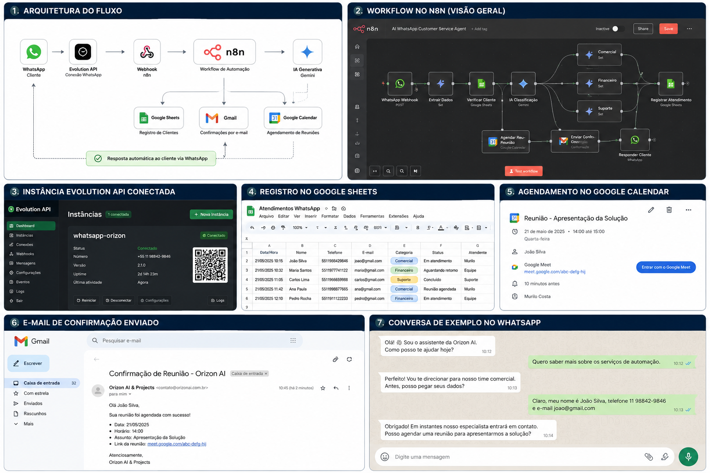

# AI WhatsApp Customer Service Agent

Agente inteligente de atendimento ao cliente via WhatsApp, desenvolvido com n8n, IA Generativa e Evolution API.

  

## Visão Geral

Este projeto automatiza o atendimento inicial de clientes via WhatsApp, realizando classificação inteligente da solicitação, registro em planilha, encaminhamento por categoria, agendamento de reuniões e envio de confirmação por e-mail.

## Problema Resolvido

Empresas que atendem via WhatsApp geralmente enfrentam desafios como:
- triagem manual de mensagens;
- perda de informações de clientes;
- demora no encaminhamento para a área correta;
- ausência de histórico estruturado;
- dificuldade para agendar reuniões de forma organizada.

## Solução

O agente automatiza o fluxo de atendimento, identificando a intenção do cliente e classificando a demanda em categorias como Comercial, Financeiro ou Suporte.

Também realiza:
- captura de nome, telefone e e-mail;
- registro em Google Sheets;
- definição de atendente responsável;
- agendamento via Google Calendar;
- envio de confirmação por Gmail;
- resposta automática via WhatsApp.

## Tecnologias Utilizadas

- n8n
- Evolution API
- WhatsApp
- IA Generativa
- Google Sheets
- Google Calendar
- Gmail
- JavaScript
- Webhooks

## Funcionalidades

- Atendimento automatizado via WhatsApp
- Classificação inteligente de mensagens
- Registro estruturado de clientes
- Encaminhamento por categoria
- Controle de duplicidade
- Agendamento de reuniões
- Confirmação por e-mail
- Respostas personalizadas com IA

## Arquitetura

WhatsApp → Evolution API → Webhook n8n → IA → Google Sheets / Gmail / Google Calendar → Resposta ao cliente

## Categorias de Atendimento

- Comercial
- Financeiro
- Suporte

## Status do Projeto

Projeto funcional em ambiente self-hosted, utilizando VPS, n8n, Evolution API, banco PostgreSQL e Redis.

## Observação

Este repositório apresenta uma versão demonstrativa e sanitizada do fluxo, sem chaves, tokens, credenciais, URLs privadas ou dados sensíveis.

## Documentação Técnica

Para mais detalhes sobre a arquitetura e os componentes da solução:

📄 [Arquitetura da Solução](docs/arquitetura.md)
